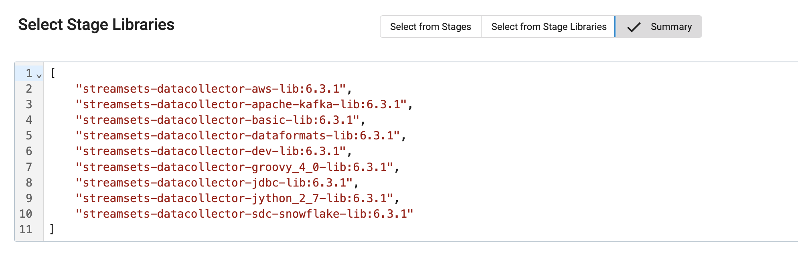
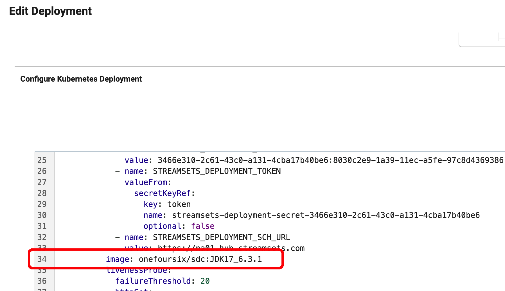
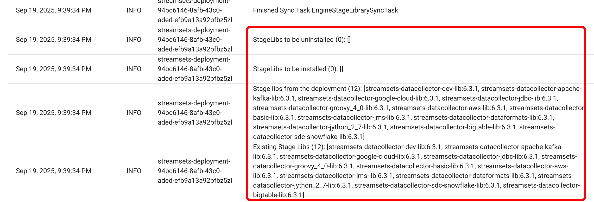
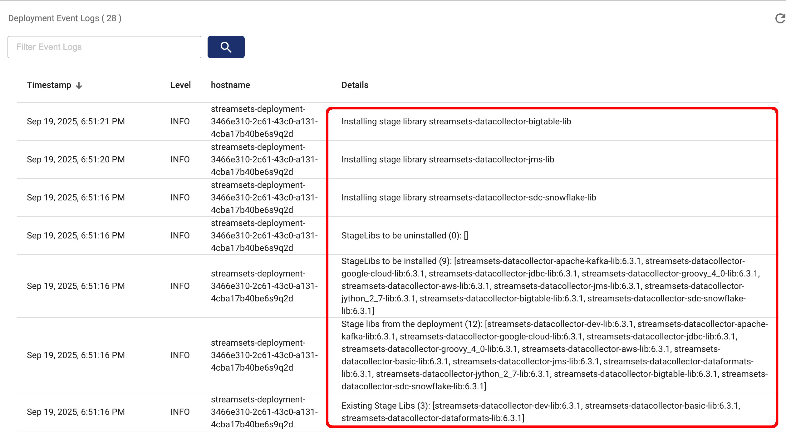

# streamsets-k8s-preloading-stage-libs
This project describes two approaches for preloading StreamSets stage libs when deploying StreamSets engines on k8s.  

These techniques can speed up the time it takes for a new StreamSets engine pod to come online if multiple stage libs would otherwise need to be downloaded across a slow WAN.

The two approaches are: 

- Building your own Docker image that extends the StreamSets engine's image and includes the desired stage libraries (i.e. "baking-in" the  stage libs).

- Using a shared Volume and an [Init Container](https://kubernetes.io/docs/concepts/workloads/pods/init-containers/) to copy the stage libs into the container at deployment time.

## Important Note
Make sure to always include the selection of stage libraries you are preloading in your Control Hub Deployment configuration as well.  This ensures that Control Hub knows what stage libraries should be present in your engine's file system.


## Technique #1: Creating a custom StreamSets Engine image with stage libraries included.

To create your own StreamSets Engine image with stage libraries included, start by cloning  this project to a linux machine and changing to the [custom-streamsets-docker-image](custom-streamsets-docker-image) dir.

- Edit the [Dockerfile](custom-streamsets-docker-image/Dockerfile) and set the version of the StreamSets engin you wish to extend.  For example, I will use this setting:

	<code>FROM streamsets/datacollector:JDK17_6.3.1</code>
	
- Edit the [build.sh](custom-streamsets-docker-image/build.sh) script and make the following changes:

  - Set the SDC_VERSION 

  - Set IMAGE_NAME to your custom image name

  - Set SDC_STAGE_LIBS to a space-delimited set of stage libraries to include.  
  
    Use only short stage library names, like <code>apache-kafka</code> as the script will
    prepend <code>streamsets-datacollector-</code> and append <code>-lib</code> to each entry.
    You do not need to include the <code>basic</code>, <code>dataformats</code>, or <code>dev</code> stage libraries as these will be included by default.
    
  - For the docker push command to work (the last line of the script), 
    login to your Docker Hub or other image registry before running the script. You can test the script without needing a Docker login by simply commenting out the last line of the script.
    
Tip: To see the full names of StreamSets stage libraries, create a scratch deployment in Control Hub, select the stage libraries you want, and then view the stage libs summary:


    
For example, I'll set these properties in my <code>build.sh</code> script:
```
# SDC Version
SDC_VERSION=6.3.1

# Your custom image name
IMAGE_NAME=onefoursix/sdc:JDK17_6.3.1

# A space delimited list of stage libs to download
SDC_STAGE_LIBS="apache-kafka aws bigtable google-cloud groovy_4.0 jdbc jms jython_2_7 sdc-snowflake"
```

Make the script executable:

<code>$ chmod +x build.sh</code>

I'll run the script to build and push the image to my repo:

<code>$ ./build.sh</code>

Assuming the script completes without errors, I can then start a local Docker container using my new image:

<code>$ docker run -d onefoursix/sdc:JDK17_6.3.1</code>

Make sure the container is running:

```
$ docker ps
CONTAINER ID   IMAGE                  COMMAND                        CREATED          ...
5d6f5e713fc8   onefoursix/sdc:JDK17_6.3.1   "/docker-entrypoint.…"   32 seconds ago   ...
```

Exec into the container and confirm the desired stage libs are present:

```
$ docker exec -it 5d6f5e713fc8 bash -c 'ls -l /opt/str*/streamsets-libs'
total 44
drwxrwxr-x 3 sdc  sdc  4096 Sep 20 02:11 streamsets-datacollector-apache-kafka-lib
drwxrwxr-x 3 sdc  sdc  4096 Sep 20 02:11 streamsets-datacollector-aws-lib
drwxrwxr-x 3 1000 root 4096 Jul 23 14:39 streamsets-datacollector-basic-lib
drwxrwxr-x 3 sdc  sdc  4096 Sep 20 02:11 streamsets-datacollector-bigtable-lib
drwxrwxr-x 3 1000 root 4096 Jul 23 14:36 streamsets-datacollector-dataformats-lib
drwxrwxr-x 3 1000 root 4096 Jul 23 14:39 streamsets-datacollector-dev-lib
drwxrwxr-x 3 sdc  sdc  4096 Sep 20 02:11 streamsets-datacollector-google-cloud-lib
drwxrwxr-x 3 sdc  sdc  4096 Sep 20 02:11 streamsets-datacollector-jdbc-lib
drwxrwxr-x 3 sdc  sdc  4096 Sep 20 02:11 streamsets-datacollector-jms-lib
drwxrwxr-x 3 sdc  sdc  4096 Sep 20 02:11 streamsets-datacollector-jython_2_7-lib
drwxrwxr-x 3 sdc  sdc  4096 Sep 20 02:11 streamsets-datacollector-sdc-snowflake-lib
```

After confirming your image has the intended stage libraries, stop and delete the container.  

To use your new custom image in a StreamSets deployment, use [Advanced Mode](https://www.ibm.com/docs/en/streamsets-controlhub?topic=deployments-kubernetes#concept_mqh_hjk_bzb__title__1) and set your own image coordinates within the deployment's yaml, like this:



Start a deployment using that new image and note in the deployment messages that no stage libraries needed to be downloaded:




## Technique #2: Use a Volume and an InitContainer to copy stage libs into your container at deployment time.


### Step 1: Create and populate a Volume


First, you'll need some type of [Volume](https://kubernetes.io/docs/concepts/storage/volumes/#volume-types) populated with your desired stage libraries.  Your choice of volume type depends on which k8s distribution you are using and if it is running on-prem or in a public cloud.  For this example, I'll use an [NFS Volume](https://kubernetes.io/docs/concepts/storage/volumes/#nfs) mapped to an NFS server on a linux machine adjacent to my k8s cluster.
 
To populate your volume, copy the [get-stage-libs.sh](stagelibs-volume/get-stagelibs.sh) script and set the StreamSets engine version and your desired set of stage libs.  You do not need to include the <code>basic</code>, <code>dataformats</code>, or <code>dev</code> stage libraries as these will be downloaded by this script by default. 

For example, these are my settings in the script:

```
# SDC Version
SDC_VERSION=6.3.1

# A space delimited list of stage libs to download
USER_STAGE_LIBS="apache-kafka aws bigtable google-cloud groovy_4.0 jdbc jms jython_2_7 sdc-snowflake"
```

Copy the script to an empty directory on a linux machine and make the script executable:

<code>$ chmod +x get-stagelibs.sh</code>

Execute the script:

<code>$ ./get-stagelibs.sh</code>

The downloaded stage libraries will be present within the parent directory <code>streamsets-datacollector-6.3.1/streamsets-libs</code>.


Move the top level <code>streamsets-datacollector-6.3.1</code> into your Volume and set read permissions on the stage libs.  For example, here is my NFS server's share directory:

```
$ sudo ls -l /srv/nfs/share/streamsets-datacollector-6.3.1/streamsets-libs/
total 44
drwxr-xr-x 3 mark mark 4096 Sep 20 00:54 streamsets-datacollector-apache-kafka-lib
drwxr-xr-x 3 mark mark 4096 Sep 20 00:54 streamsets-datacollector-aws-lib
drwxr-xr-x 3 mark mark 4096 Sep 20 00:54 streamsets-datacollector-basic-lib
drwxr-xr-x 3 mark mark 4096 Sep 20 00:54 streamsets-datacollector-bigtable-lib
drwxr-xr-x 3 mark mark 4096 Sep 20 00:54 streamsets-datacollector-dataformats-lib
drwxr-xr-x 3 mark mark 4096 Sep 20 00:54 streamsets-datacollector-dev-lib
drwxr-xr-x 3 mark mark 4096 Sep 20 00:55 streamsets-datacollector-google-cloud-lib
drwxr-xr-x 3 mark mark 4096 Sep 20 00:55 streamsets-datacollector-jdbc-lib
drwxr-xr-x 3 mark mark 4096 Sep 20 00:55 streamsets-datacollector-jms-lib
drwxr-xr-x 3 mark mark 4096 Sep 20 00:55 streamsets-datacollector-jython_2_7-lib
drwxr-xr-x 3 mark mark 4096 Sep 20 00:55 streamsets-datacollector-sdc-snowflake-lib
```
### Step 3: Create and start a StreamSets Kubernetes Deployment
Create a StreamSets Kubernetes Deployment. There is no need to edit the image used, as we want to use the default image which will be something like <code>streamsets/datacollector:JDK17_6.3.1</code>.

Make sure to configure the deployment with all of the stage libraries you will later preload. At this point, to understand how things work, start the deployment without yet preloading the stage libs.  As the deployment starts, you should see confirmation that the specified stage libs are being downloaded as part of the bootstrap process:



Stop the deployment which will terminate the engine.

Step 4: Add Volumes and an InitContainer to the Deployment

Edit the deployment's Advanced Mode and add sections for two Volumes - one for the Volume with the stage libs, another for an [emptyDir](https://kubernetes.io/docs/concepts/storage/volumes/#emptydir) that will be used by the InitContainer.  Here is a snippet of the two Volumes (a full example deployment manifest example is [here] )


  For example, my NFS Volume looks like this:


